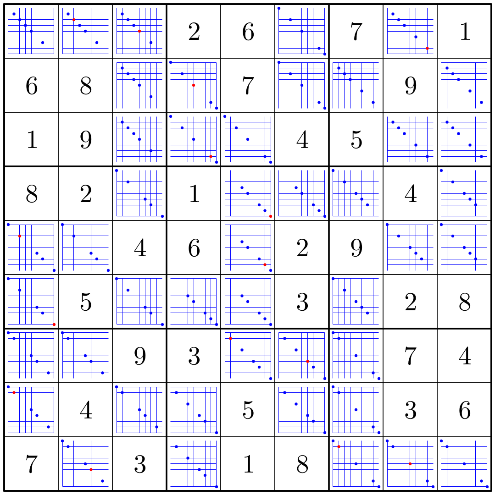

# Sudoku Tools

Tools for analyzing Sudoku puzzles.



This can be generated by executing:

```shell
$ cd src ; ./rule-compliance ../var/samples/example1.txt ../var/samples/example1_rule_compliance.pdf
```

